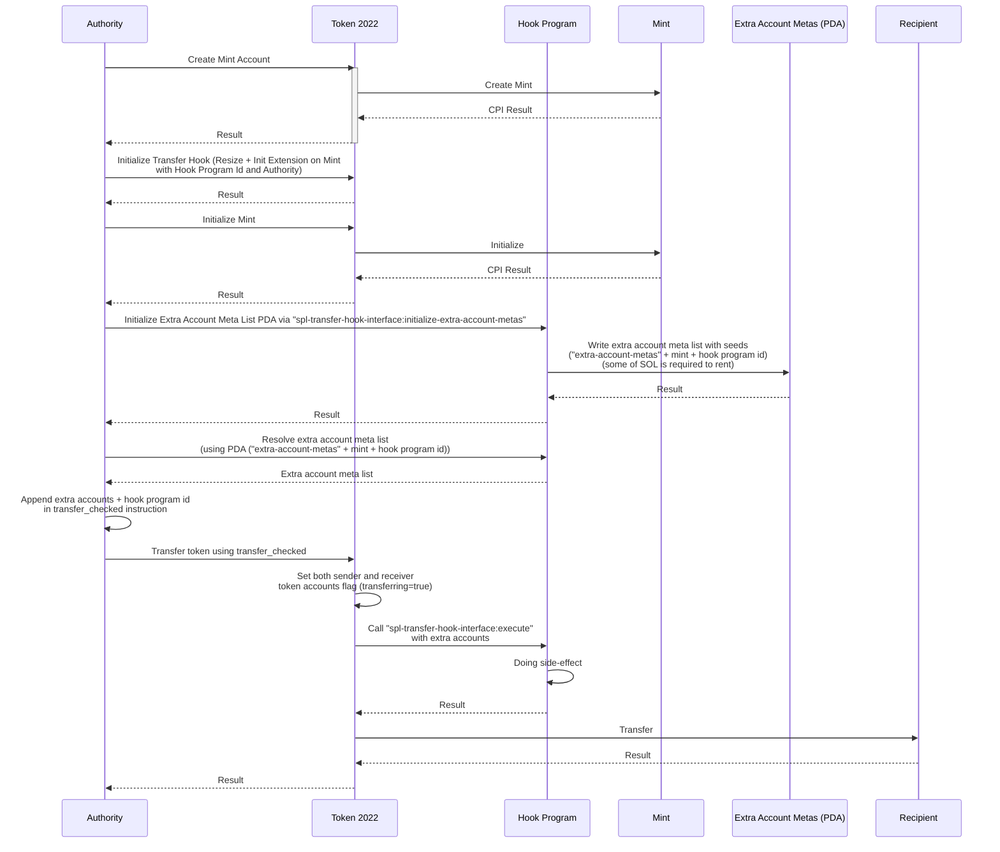

# SPL-Token 2022 Transfer Hook with Anchor Framework Example

## Overview

This repository contains an example implementation of the SPL-Token 2022 Transfer Hook Program Interface using Anchor Framework. In addition to demonstrating the basic functionality of a transfer hook, this example also includes a feature to count the number of times the transfer hook has been invoked.

## Getting Started

1. Clone this repository to your local machine:

   ```
   git clone https://github.com/imalic3/spl-token-2022-transfer-hook-anchor.git
   ```

2. Navigate to the project directory:

   ```
   cd spl-token-2022-transfer-hook-anchor
   ```

3. Install project dependencies:

   ```
   anchor build
   ```

## Usage

To run the example transfer hook, follow these steps:

1. Start a local Solana cluster:

   ```
   solana-test-validator
   ```

2. Run the example transfer hook:

   ```
   anchor test --skip-local-validator
   ```

This will execute the transfer hook, demonstrating its functionality with SPL-Token transactions.

## How it works

Here's an illustrates the process of an SPL-Token transfer hook interface works with Hook Program.



## Contributing

If you find any issues or have suggestions for improvements, please feel free to open an issue or create a pull request.

## License

This project is licensed under the [MIT License](LICENSE).
